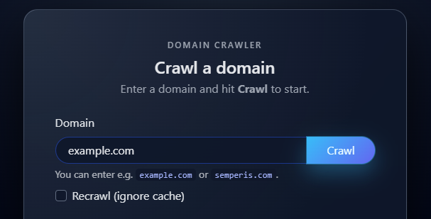

# SubCrawler
SubCrawler is a simple application that allows you to collect all available subdomains of the provided domain.

## Features
- **Simple usage:** Gathers the subdomains based on the requested domain.
- **Wellknown source of data:** Utilizing the crt.sh API and collects the subdomains based on the past certificates and SANs.
- **Local storage:** Stores the collected subdomains in a file to prevent recrawling already existing data.
- **Recrawl:** Has option to recrawl already existing domain.
- **Fast response:** The collected results are also stored in Redis for cached responses.
- **Dockerized:** Easily containerized for streamlined deployment.

## Structure
```
subcrawler
    ├── Dockerfile
    ├── README.md
    ├── app.py
    ├── csv_db
    │   └── domain_results.csv
    ├── docker-compose.yml
    ├── kubernetes_version
    │   ├── autoscaler-subcrawler.yaml
    │   ├── configmap-redis-envs.yaml
    │   ├── cronjob-backupcsv.yaml
    │   ├── deployment-redis.yaml
    │   ├── deployment-subcrawler.yaml
    │   ├── namespaces.yaml
    │   ├── pv-claim.yaml
    │   ├── pv.yaml
    │   ├── service-redis.yaml
    │   ├── service-subcrawler.yaml
    │   └── subcrawler-kube-deploy.yaml
    ├── requirements.txt
    ├── static
    │   └── example.png
    └── templates
        └── index.html
```
## Docker Prerequisites

[Docker](https://docs.docker.com/get-docker/) <br>
[Docker Compose](https://docs.docker.com/compose/install/) 

## Installation
1. Clone the Repository:
```bash
git clone https://github.com/gh0stik/subcrawler.git
cd /subcrawler
```
2. Spin up the environment:
```bash
docker-compose up --build
```
3. Once the containers are running, the app is available at:
```bash
http://127.0.0.1:5000
```

## Kubernetes (Minikube) - Prerequisites

- **Windows**

**Install Minikube:**<br>
<br >
To install Minikube manually, download [minikube-windows-amd64](https://github.com/kubernetes/minikube/releases/latest), rename it to minikube.exe,
and add it to your PATH. **NOTE**: Make sure you choose minikube-windows-amd64.exe
<br >
<br >
**Kubectl:**<br > 
To install kubectl, download [kubectl](https://storage.googleapis.com/kubernetes-release/release/v1.22.0/bin/windows/amd64/kubectl.exe) binary for Windows.
**Start Minikube:**<br>
```aiignore
minikube.exe start --driver=docker
```

- **Linux**<br>

**Install Minikube:**<br>
```bash
curl -LO https://storage.googleapis.com/minikube/releases/latest/minikube-linux-amd64
sudo install minikube-linux-amd64 /usr/local/bin/minikube
```
**Install Kubectl:**<br>
```bash
sudo apt-get update
sudo apt-get install -y kubectl
```
**Start minikube:**<br>
```bash
minikube start --driver=docker
```

## Deploying the YAMLs ##
```bash
cd kubernetes_version

# Create all resources (namespaces, PV/PVC, Deployments, Services, CronJobs, etc.)
kubectl apply -f subcrawler-kube-deploy.yaml
```

## Accessing the Application ##
Start the minikube service tunnel:
```bash
minikube service subcrawler -n application
```
Browse the localhost over tunneled port:
```aiignore
http://127.0.0.1:<tunelled port>
```